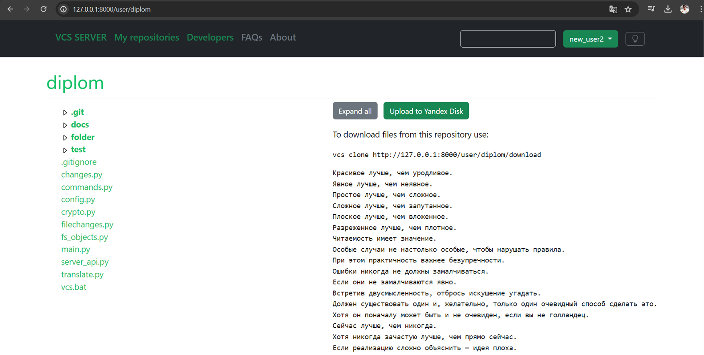

# Дипломная работа
## Cоздание VCS (системы контроля версий)

В этом репозитории хранится серверная часть проекта, клиент VCS - https://github.com/MrR3353/diplom/tree/main

## Стек:
* Django
* Stripe
* Dropzone

## Функциональные требования:
* Аутентификация и авторизация
* Редактирование личной информации
* Хранение данных репозиториев
* Создание репозитория
* Клонирование репозитория
* Удаление репозитория
* Просмотр содержимого репозитория
* Изменение параметров репозитория
* Взаимодействие с клиентской частью
* Выбор сервера для хранения данных
* Встроенная торговая площадка
* Администрирование

Презентация: https://github.com/MrR3353/diplom/blob/main/docs/%D0%9F%D1%80%D0%B5%D0%B7%D0%B5%D0%BD%D1%82%D0%B0%D1%86%D0%B8%D1%8F.pptx  
Видео: https://github.com/MrR3353/diplom/tree/main/docs/%D0%92%D0%B8%D0%B4%D0%B5%D0%BE
